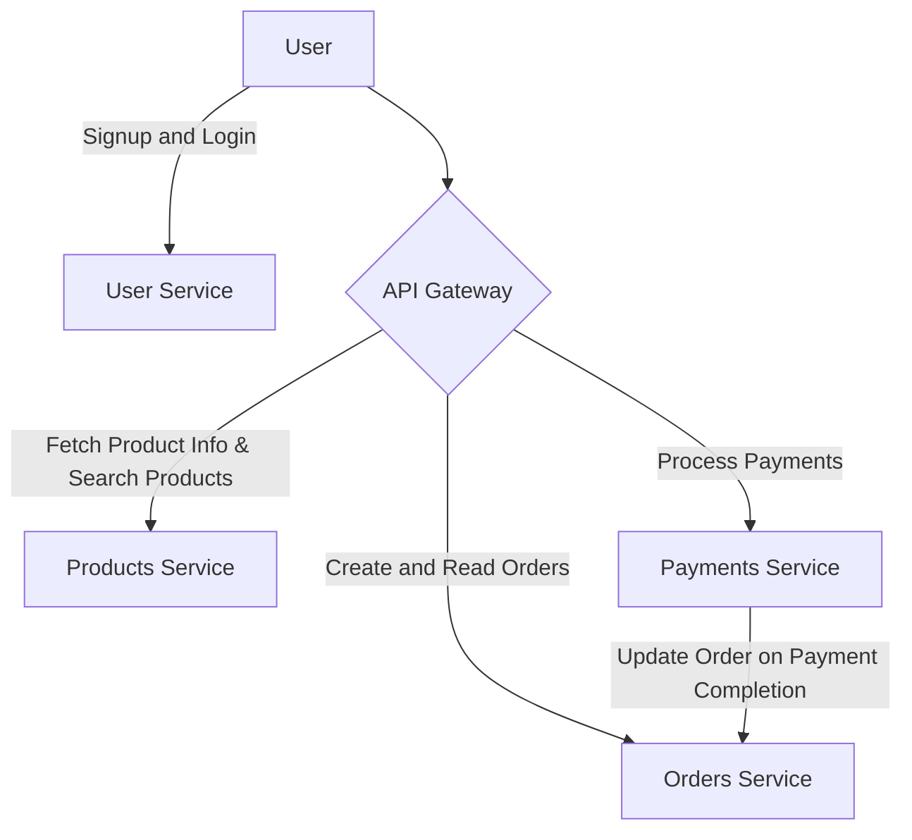

# Welcome to the Tilt and Telepresence Workshop

This demo includes four microservices designed to demonstrate the usage of **Tilt**, **Telepresence** and **ArgoCD (Preview Environments)** on Kubernetes.

## Services


### Service Overview

| Service           | Directory  | Purpose  | User Facing |
|------------------|------------|------------|-------------|
| **Users Service** | [telepresence-demo-user-service](./telepresence-demo-user-service/) | Handles user signup and login. Issues JWT tokens for authentication and authorization via the API Gateway. | ✅ |
| **Products Service** | [telepresence-demo-product-service](./telepresence-demo-product-service/) | Provides product catalog search functionality. | ❌ |
| **Orders Service** | [telepresence-demo-orders-service](./telepresence-demo-orders-service/) | Manages order creation, status updates (PENDING/PAID), and order retrieval. | ❌ |
| **Payments Service** | [telepresence-demo-payments-service](./telepresence-demo-payments-service/) | Facilitates payments and allows users to view past transactions. | ❌ |
| **API Gateway** | [telepresence-demo-api-gateway](./telepresence-demo-api-gateway/) | Protects the Orders and Payments API using JWT tokens (issued by the Users Service). This service allows users to create and view orders, make payments, and check payment status. | ✅ |

## User Flow
All API requests can be found in the Postman Collection: [Tilt-n-Telepresence-Demo.postman_collection.json](./Tilt-n-Telepresence-Demo.postman_collection.json).

### 1. User Signup & Authentication
- If not already registered, the user signs up via the **Users Service**.
- Upon signup, the user obtains a **JWT token**.

### 2. Product Search (No Authentication Required)
Users can browse products via the API Gateway:
```plaintext
GET /api/v1/products                   # View all products
GET /api/v1/products/category/:name    # Search by category
GET /api/v1/products/search/:name      # Search by name
GET /api/v1/products/:product_id       # Get details of a specific product
```

### 3. Creating an Order (JWT Token Required)
- API Endpoint: `/api/v1/order/create`
- Example cURL Request:
  ```bash
  curl --location 'http://api-gateway.api/api/v1/order/create' \
      --header 'Content-Type: application/json' \
      --header 'Authorization: Bearer <JWT Token>' \
      --data '{ "product_ids": ["L9ECAV7KIM", "OLJCESPC7Z"] }'
  ```
- Example Response:
  ```json
  {
      "order": {
          "id": "d7f4deda-d2f0-40a5-99a0-d0287a855edf",
          "user_id": "6cde8acb-c7e0-420e-8d10-7ada0a190430",
          "product_ids": ["L9ECAV7KIM", "OLJCESPC7Z"],
          "status": "pending"
      },
      "amount": 109.08
  }
  ```

### 4. Making a Payment
- API Endpoint: `/api/v1/payments/pay`
- Example cURL Request:
  ```bash
  curl --location 'http://api-gateway.api/api/v1/payments/pay' \
      --header 'Content-Type: application/json' \
      --header 'Authorization: Bearer <JWT Token>' \
      --data '{ "order_id": "67a06c81-c46c-43d5-a7dd-2f3a1c085132", "amount": 109.08 }'
  ```
- Example Response:
  ```json
  {
      "id": "7084ae0a-d386-4ecd-913d-17c72b408c2c",
      "user_id": "6cde8acb-c7e0-420e-8d10-7ada0a190430",
      "order_id": "67a06c81-c46c-43d5-a7dd-2f3a1c085132",
      "amount": 109.08,
      "status": "paid"
  }
  ```

### 5. Checking Payment Status
- API Endpoint: `/api/v1/payments/status/:payment_id`
- Example cURL Request:
  ```bash
  curl --location 'http://api-gateway.api/api/v1/payments/status/7084ae0a-d386-4ecd-913d-17c72b408c2c' \
      --header 'Authorization: Bearer <JWT Token>'
  ```
- Example Response:
  ```json
  {
      "id": "7084ae0a-d386-4ecd-913d-17c72b408c2c",
      "user_id": "6cde8acb-c7e0-420e-8d10-7ada0a190430",
      "order_id": "67a06c81-c46c-43d5-a7dd-2f3a1c085132",
      "amount": 109.08,
      "status": "paid"
  }
  ```

# Flow of the workshop
## Pre-requisites
1. A remote k8s cluster. (EKS, GKE, Minikube, etc.)
2. Install ArgoCD for preview environments.
3. Docker installed.
4. Linux/Mac preferred.
5. Install Tilt.
6. Install Telepresence.
7. Setup Postman.

## Flow
1. Develop the User Service using Tilt and run it inside the Kubernetes cluster.
2. Follow the same process for the Products and Orders services.
3. Deploy all three services to the remote Kubernetes cluster.
4. Set up Telepresence to connect to the remote cluster.
5. Develop the Payments Service locally using Telepresence to access dependent services inside the cluster.
6. Deploy the Payments Service to the cluster.
7. Repeat the same process as the Payments Service to develop and deploy the API Gateway Service using Telepresence.
8. For the preview environments make code changes on the 


# [Part 1] Developing Services with Tilt  

### 1. Navigate to the Service Directory  
We will use **Tilt** to develop the following services:  

| Service         | Directory |  
|----------------|--------------------------------------------|  
| Users Service  | [telepresence-demo-user-service](./telepresence-demo-user-service/) |  
| Products       | [telepresence-demo-product-service](./telepresence-demo-product-service/) |  
| Orders Service | [telepresence-demo-orders-service](./telepresence-demo-orders-service/) |  

### 2. Set Up a Python Virtual Environment  
Run the following commands to set up the development environment:  
```bash
python3 -m venv venv
source venv/bin/activate
make install-dev
```  

### 3. Start Developing Directly on the Cluster  
> **Important**: If developing on a remote cluster, Tilt may show the following error:  
>  
> _Stop! `name_of_k8s_context` might be production._  
> _If you're sure you want to deploy there, add:_  
> `allow_k8s_contexts("name_of_k8s_context")`  
> _to your Tiltfile. Otherwise, switch k8s contexts and restart Tilt._  

To resolve this, add the following line at the beginning of the `Tiltfile` in the service’s root directory:  
```python
allow_k8s_contexts("name_of_k8s_context")
```  

Then, start Tilt:  
```bash
tilt up
```  

### 4. Auto-Update on Code Changes  
Tilt will automatically update the running container inside the Kubernetes pod as you make changes.  

### 5. Shut Down Tilt  
To stop Tilt, press <kbd>Ctrl</kbd> + <kbd>C</kbd> and run:  
```bash
tilt down
```  

### 6. Deploy the Developed Version to the Cluster  
Once development is complete, deploy the service to the cluster:  
```bash
make deploy-dev
```  

# [Part 2] Developing a Service with Telepresence  

### 1. Install Telepresence and Connect to Your Cluster

```bash
 # Install the Open Source
 brew install telepresenceio/telepresence/telepresence-oss
```

You can choose to install the telepresence from Ambassador Cloud
``` bash
# Install the SaaS offering from Ambassador Cloud
brew install datawire/blackbird/telepresence
```

**Install the Traffic Manager on the Cluster**

   ```bash
   telepresence helm install
   ``` 
**Connect to the Cluster** 

   ```bash
   telepresence connect --namespace=api  
   ```  
   > **Note**: You can replace `api` with a different namespace if needed. For this demo, we will use `api` as our services are deployed there.  

### 2. Start Developing
- We will develop the following services using **Telepresence**. Navigate to the appropriate service directory: 

   | Service          | Directory |  
   |------------------|------------------------------------------------|  
   | Payments Service | [telepresence-demo-payments-service](./telepresence-demo-payments-service/) |  
   | API Gateway      | [telepresence-demo-api-gateway](./telepresence-demo-api-gateway/) |  

- **Set Up a Python Virtual Environment**
   ```bash
   python3 -m venv venv
   source venv/bin/activate
   make install-dev
   ```  
- You can now directly modify the codebase—no additional setup is required.

- **Run the Service Locally (Development Mode)**
   ```bash
   cd ./src/
   uvicorn app:app --host 0.0.0.0 --port 8080 --reload  
   ```  

## Step 2: Deploy Changes to Kubernetes  

Once you're satisfied with your changes, deploy the updated service to the cluster:  
```bash
make deploy-dev
```  

# [Part 3] Scenario: Telepresence Intercept Demo

## **Problem Statement**  
1. The **Payments Service** currently does not verify whether an order has already been paid, which may lead to **duplicate payments** for the same order.  
2. Setting up all dependent services **locally** is inconvenient.  
3. The cluster is accessible, and the Payments Service code is available.  

## **Solution**  

### **Step 1: Setup the Local Development Environment**  
1. Navigate to the **Payments Service** directory:  
   ```bash
   cd telepresence-demo-payments-service
   ```  
2. Set up a virtual environment (**if not done already**):  
   ```bash
   python3 -m venv venv
   source venv/bin/activate
   make install-dev
   ```  
3. Run the **local instance** of the Payments Service:  
   ```bash
   cd src/
   uvicorn app:app --host 0.0.0.0 --port 8080 --reload  
   ```  

### **Step 2: Intercept the Service using Telepresence**  
1. Start a **Telepresence intercept** for `payments-svc`:  
   ```bash
   telepresence intercept payments-svc --port 8080  
   ```  
   > **How it works**:  
   > - Any requests from services inside the cluster (e.g., **API Gateway**) to `payments-svc` will be **re-routed** to your local instance instead of the one running in Kubernetes.  

### **Step 3: Modify the Payments Service**  
1. Open and modify [`telepresence-demo-payments-service/src/app.py`](./telepresence-demo-payments-service/src/app.py) to **prevent duplicate payments**:  

   ```python
   import os
   import uuid
   from typing import Dict

   import requests
   from fastapi import FastAPI, HTTPException

   from models import Payment

   app = FastAPI()

   # In-memory payment store
   payments: Dict[str, Payment] = {}

   ORDER_SERVICE_URL = os.getenv("ORDER_SERVICE_URL", "http://orders-svc.api")

   def check_if_order_already_paid_for(order_id: str):
       response = requests.get(f"{ORDER_SERVICE_URL}/orders/{order_id}")
       if response.status_code != 200:
           raise HTTPException(status_code=response.status_code, detail=response.json())

       order_info = response.json()
       order_status = order_info.get("status")

       if not order_status:
           raise HTTPException(status_code=500, detail="Internal Server Error")

       print(order_info)
       if order_status == "paid":
           raise HTTPException(status_code=403, detail="Already Paid")

   @app.get("/healthz", status_code=201)
   async def health():
       return {"message": "Hi Mom!"}

   @app.post("/payments", response_model=Payment)
   def process_payment(payment: Payment):
       payment.id = str(uuid.uuid4())
       payments[payment.id] = payment

       # Check if order is already paid
       check_if_order_already_paid_for(payment.order_id)

       # Update order status after successful payment
       update_order_url = f"{ORDER_SERVICE_URL}/orders/{payment.order_id}/status"
       response = requests.patch(update_order_url, params={"status": "paid"})

       if response.status_code != 200:
           raise HTTPException(status_code=500, detail="Internal Server Error")

       payment.status = "paid"
       return payment

   @app.get("/payments/{payment_id}", response_model=Payment)
   def get_payment(payment_id: str):
       if payment_id not in payments:
           raise HTTPException(status_code=404, detail="Payment not found")
       return payments[payment_id]
   ```

### **Step 4: Test the Changes**  
1. The **server will automatically reload** after code modifications.  
2. **Test the updated Payments Service** using the provided [Postman Collection](./Tilt-n-Telepresence-Demo.postman_collection.json):  
   - **Create an Order**  
   - **Make a payment** for the corresponding **Order ID**  
   - ✅ Payment should be **successful**  
   - **Attempt to pay for the same Order ID again**  
   - ❌ The request should **fail** with an error

### **Step 5: Deploy to Kubernetes**
1. Stop the intercept
   ```bash
   telepresence leave payments-svc
   ```
2. Deploy this version to Kubernetes.
   ```bash
   cd ..
   make deploy-dev
   ```

# [Part 4] PR based Preview Environments

PR based preview environments are used to test the changes before merging them into the main branch. It is used to test new features before they are released. They are especially useful to Product teams, and sales team to demo a particular feature.

We will do the PR based preview environments on our local machine to avoid the hassle of getting a new domain. We will use DNSMASQ on our local machine to create a subdomain for each PR. 

For a remote Kubernetes cluster setup a wildcard DNS entry for the domain you are using. Example: `*.example.com` should point to the CNAME of your IngressController ALB.

## Step 1: Setup local K8S Cluster and ArgoCD

### On Mac
1. Install Docker Desktop
2. Enable Kubernetes in Docker Desktop
3. Install ArgoCD

   ```bash
    kubectl create namespace argocd
    kubectl apply -n argocd -f https://raw.githubusercontent.com/argoproj/argo-cd/stable/manifests/install.yaml
   ```
3. Install Nginx Ingress Controller 

   ```bash
   helm upgrade --install ingress-nginx ingress-nginx 
   --repo https://kubernetes.github.io/ingress-nginx \
   --namespace ingress-nginx --create-namespace
   ```

4. Install DNSMASQ
   
   ```bash
   brew install dnsmasq
   ```

   ```bash
   # Create config directory
   mkdir -pv $(brew --prefix)/etc/
   ```

   ```bash
   sudo brew services start dnsmasq
   ```

5. Configure DNSMASQ

   ```bash
   # Setup *.example.com
   echo 'address=/.example.com/127.0.0.1' >> $(brew --prefix)/etc/dnsmasq.conf
   ```
 
   ```bash
   sudo mkdir -v /etc/resolver
   sudo bash -c 'echo "nameserver 127.0.0.1" > /etc/resolver/test'
   ```

### On Linux
1. Install Minikube
2. Install ArgoCD

   ```bash
    kubectl create namespace argocd
    kubectl apply -n argocd -f https://raw.githubusercontent.com/argoproj/argo-cd/stable/manifests/install.yaml
   ```
3. Install Nginx Ingress Controller

   ```bash
   minikube addons enable ingress
   ```
4. Install DNSMASQ
   Depending on the distribution you are using, you can install DNSMASQ using the package manager.

5. Configure DNSMASQ

   ```bash
   # Setup *.example.com
   echo 'address=/.example.com/<minikube-ip-should be interface IP of host machine>' >> /etc/dnsmasq.conf
   ``` 

## Step 2: Create an ApplicationSet in ArgoCD

We will take the example of the Product Service. We will create a new branch and make some changes to the Product Service. We will then create a PR and deploy the changes to the preview environment.

Before we start, we need to create an ApplicationSet in ArgoCD. This will create a new application for each PR.

We have already create the YAML manifest to create the ApplicationSet. You can find under `telepresence-demo-product-service/k8s/argocd/generators/product.yaml`

```bash
kubectl apply -f telepresence-demo-product-service/k8s/preview-env/generators/product.yaml -n argocd
```
You also need to create a secret for the GitHub token. You can create the secret using the following command.
Edit the secret.yaml and add your GitHub token.

```yaml
apiVersion: v1
kind: Secret
metadata:
  name: github-token
stringData:
  token: `<add your github token>`
```

```bash 
kubectl apply -f telepresence-demo-product-service/k8s/preview-env/secret.yaml -n argocd
```
## Step 3: Let's create a PR based preview environment

Make a code change in the Product Service. Let's change the following function in the `app.py` file.

```python
@app.get("/healthz", status_code=201)
async def health():
    return {"message": "Hello from Products Service!"}
```

You can try changing the message. Add the changes to the git and create a new branch.

```python
@app.get("/healthz", status_code=201)
async def health():
    return {"message": "Hello from Products Service! This is a PR based preview environment!"}
```

Let's call the branch `product-message-change`. Push the changes to the branch and open a PR.
Add the label `preview` to the PR. This will trigger the ApplicationSet to create a new application for the PR in a new namespace

## Step 4: Access the PR based preview environmentG

You can access the PR based preview environment using the following URL.

```
http://product-<branch-name>-<pr-number>.example.com/healthz
```

## Step 5: Clean up

Merge or close the PR to delete the preview environment.
