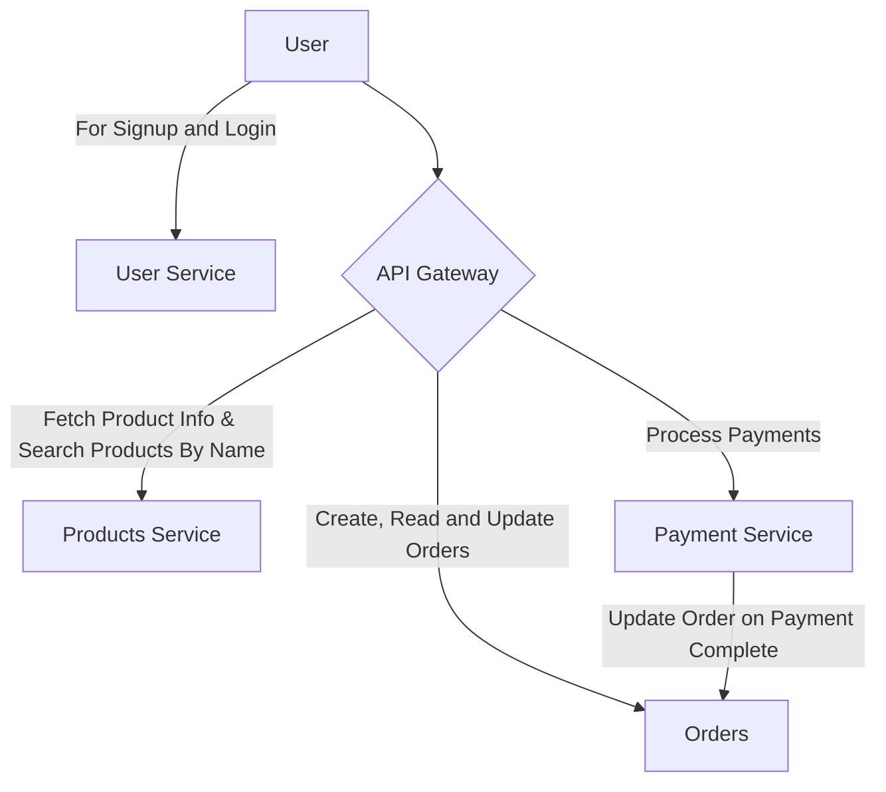

# Welcome to Tilt and Telepresence Workshop

This demo has 4 dumb services to quickly demo tilt and telepresence on Kubernetes. 
## Services 


|Service|Directory|Purpose|User Facing|
|--|--|--|--|
|Users Service|[telepresence-demo-user-service](./telepresence-demo-user-service/)|Provides Functionality to Signup and Login. Issues JWT Tokens for authentication and authorisation with API Gateway.|✅|
|Products|[telepresence-demo-product-service](./telepresence-demo-product-service/)|Provides Functionality to search through product Catalogue|❌|
|Orders Service|[telepresence-demo-orders-service](./telepresence-demo-orders-service/)|Provides Functionality to Create an Order, Update it's status [PENDING/PAID] and Viewing the Order Info.|❌|
|Payments Service|[telepresence-demo-payments-service](./telepresence-demo-payments-service/)|Provides Functionality to Make a Payment and view Past Payments|❌|
|API Gateway|[telepresence-demo-api-gateway](./telepresence-demo-api-gateway/)|Protects Orders and Payments API using JWT (obtained via Users Service). This service is user facing and allows users to create orders, view their status, make payments and view payment status |✅|


## User Flow for our Services
You can find all the requests in the Postman Collection [here](./Tilt-n-Telepresence-Demo.postman_collection.json).
1. User Signup via Users Service (if not registered already).
2. Obtain a JWT Token. 
3. Search For Products from API Gateway (JWT Token not required)
   - User can view all products from `/api/v1/products`
   - User can search products by category from `/api/v1/products/category/:search_string`
   - User can search products by name from `/api/v1/products/search/:search_string`
   - User can find information about a product by ID from `/api/v1/products/:product_id`
4. To create an order (JWT Token needed).
   - Makes a request to `/api/v1/order/create`
     ```bash
     # Example cURL request
     curl --location 'http://api-gateway.api/api/v1/order/create' \
        --header 'Content-Type: application/json' \
        --header 'Authorization: Bearer <Token Here>' \
        --data '{
            "product_ids": ["L9ECAV7KIM", "OLJCESPC7Z"]
        }'

     ```
   - Gets a response in following format
     ```json
        // Example Response
        {
            "order":{
                "id":"d7f4deda-d2f0-40a5-99a0-d0287a855edf",  // This is your order_id "user_id":"6cde8acb-c7e0-420e-8d10-7ada0a190430",
                "product_ids":[
                    "L9ECAV7KIM",
                    "OLJCESPC7Z"
                ],
                "status":"pending"
            },
            "amount":109.08
        }
      ```
5. Payment.
   - Makes a request to `/api/v1/payments/pay`
    ```bash
    # Example cURL
    # If the amount does not match the order value the api returns an error
    curl --location 'http://api-gateway.api/api/v1/payments/pay' \
        --header 'Content-Type: application/json' \
        --header 'Authorization: Bearer <Token Here>' \
        --data '{
            "order_id": "67a06c81-c46c-43d5-a7dd-2f3a1c085132",
            "amount": 109.08
        }'
    ```
    - Response
    ```json
    // Example response
    {
        "id": "7084ae0a-d386-4ecd-913d-17c72b408c2c", // This is your payment id
        "user_id": "6cde8acb-c7e0-420e-8d10-7ada0a190430",
        "order_id": "67a06c81-c46c-43d5-a7dd-2f3a1c085132",
        "amount": 109.08,
        "status": "paid"
    }
    ```
6. If the user wants to view status of previous payments.
   - Makes a request `/api/v1/payments/status/:payment_id`
   ```bash
   # Example cURL Request.
   curl --location 'http://api-gateway.api/api/v1/payments/status/7084ae0a-d386-4ecd-913d-17c72b408c2c' \
    --header 'Authorization: Bearer <Token Here>'
   ```
   - Response
   ```json
   {
        "id": "7084ae0a-d386-4ecd-913d-17c72b408c2c",
        "user_id": "6cde8acb-c7e0-420e-8d10-7ada0a190430",
        "order_id": "67a06c81-c46c-43d5-a7dd-2f3a1c085132",
        "amount": 109.08,
        "status": "paid"
    }
   ```


# Flow of the workshop
## Pre-requisites
1. A remote k8s cluster. (EKS, GKE, etc.)
2. Docker installed.
3. Linux/Mac preferred.
4. Install Tilt.
5. Install Telepresence.

## Flow
1. We will first develop the User Service and use Tilt to debug it directly inside the Kubernetes Cluster.
2. We will similarly develop Products and Orders Service.
3. Then we will deploy these services to our remote k8s cluster.
4. Now we will setup Telepresence to connect to our remote cluster directly.
5. Now we will develop Payments Service locally by directly accessing the service on the k8s cluster. 
6. Now we will deploy Payments Service on the cluster.
7. Now we will repeat the same process to develop the API Gateway Service.

# How to develop services via Tilt
1. Head to the directory containing the service code. We will use Tilt to develop the following services.
   |Service|Directory|
    |--|--|
    |Users Service|[telepresence-demo-user-service](./telepresence-demo-user-service/)|
    |Products|[telepresence-demo-product-service](./telepresence-demo-product-service/)|
    |Orders Service|[telepresence-demo-orders-service](./telepresence-demo-orders-service/)|
    
2. Setup Python venv.
   ```bash
   python3 -m venv venv
   source venv/bin/activate
   make install-dev
   ```
3. To start developing directly on the cluster
   > **Important**:  
    On running the below commands, Tilt will throw the following error when developing on a remote cluster.   
   Stop! _`name_of_k8s_context`_ might be production.
If you're sure you want to deploy there, add:
	allow_k8s_contexts('_`name_of_k8s_context`_')
to your Tiltfile. Otherwise, switch k8s contexts and restart Tilt.  
Just modify the file named `Tiltfile` at the root directory of every service by adding the following lines at the beginning of your `Tiltfile`.  
allow_k8s_contexts('_`name_of_k8s_context`_')
    
   ```bash
   tilt up
   ```
4. As you make changes to your code the pod on k8s will update automatically.
5. To shutdown tilt. Press <kbd>ctrl-c</kbd> and run the following command
   ```bash
   tilt down
   ```
6. Finally, we would like to deploy the developed version of the service on the cluster.
    ```bash
    make deploy-dev
    ```

# How to develop service with telepresence
## Step 0: Install Telepresence on your cluster and setup a Telepresence Connect to your cluster.
1. Install Traffic Manager on cluster
    ```bash
    telepresence helm install
    ```
2. Connect to the cluster 
    ```bash
    telepresence connect --namespace=api # You can replace this with the namespace of your choice. Since, we are developing our services in the api namespace, so stick to api for the sake of this demo.
    ```

## Step 1: Start Developing
1. We will develop following services with Telepresence. Head to the directory containing the service.

|Service|Directory|
|--|--|
|Payments Service|[telepresence-demo-payments-service](./telepresence-demo-payments-service/)|
|API Gateway|[telepresence-demo-api-gateway](./telepresence-demo-api-gateway/)|

2. Setup your Python venv:
    ```bash
    python3 -m venv venv
    source venv/bin/activate
    make install-dev
    ```
3. Now you can directly work on the codebase no more setup needed.
4. To run services locally (development server)
    ```bash
    cd ./src/
    uvicorn app:app --host 0.0.0.0 --port 8080 --reload  
    ```

## Step 2. I'm happy with my changes I want to deploy it to k8s now.
1. Head to the directory containing code for your service, and, run the following commands
   ```bash
   make deploy-dev
   ```

## Scenario (Demo for Telepresence Intercept)
### Problem Statement
1. Right now if the Payment Service does not check if an order is already paid, this means that we can make duplicate payments against the same order.
2. I do not want to setup all services on my local environment.
3. I already have access to cluster and the code for Payments Service. 

### Solution.
1. Head over to [telepresence-demo-payments-service](./telepresence-demo-payments-service/) directory.
2. Setup venv (if not done already).
   ```bash
   python3 -m venv venv
   source venv/bin/activate
   make install-dev
   ```
3. Run a local copy of the service. 
   - cd to [this directory](./telepresence-demo-payments-service/src/) and run these commands.
        ```bash
        uvicorn app:app --host 0.0.0.0 --port 8080 --reload 
        ```
4. Start a telepresence intercept.
   ```bash
   telepresence intercept payments-svc  --port 8080 
   ```
   Now, if a service inside the cluster (API Gateway in this case) wants to make a request to `payments-svc` (Payments Service), the request will be re-routed to the local version of the payments service running on your laptop.
5. Run the following command to intercept 
6. Head over to [this file](./telepresence-demo-payments-service/src/app.py)
   Edit the file as follows
   ```python
    import os
    import uuid
    from typing import Dict

    import requests
    from fastapi import FastAPI, HTTPException

    from models import Payment

    app = FastAPI()

    # In-memory order store
    payments: Dict[str, Payment] = {}

    ORDER_SERVICE_URL = os.getenv("ORDER_SERVICE_URL", "http://orders-svc.api")


    def check_if_order_already_paid_for(order_id: str):
        response = requests.get(f"{ORDER_SERVICE_URL}/orders/{order_id}")
        if not response.status_code == 200:
            raise HTTPException(
                status_code=response.status_code, detail=response.json()
            )
        order_info = response.json()
        order_status = order_info.get("status", None)
        if not order_status:
            raise HTTPException(status_code=500, detail="Internal Server Error")
        print(order_info)
        if order_status == "paid":
            raise HTTPException(status_code=403, detail="Already Paid")


    @app.get("/healthz", status_code=201)
    async def health():
        return {"message": "Hi Mom!"}


    @app.post("/payments", response_model=Payment)
    def process_payment(payment: Payment):
        payment.id = str(uuid.uuid4())
        payments[payment.id] = payment

        # After payment, update the order status in Orders Service
        update_order_url = f"{ORDER_SERVICE_URL}/orders/{payment.order_id}/status"
        # check if order is already paid
        check_if_order_already_paid_for(payment.order_id)
        response = requests.patch(update_order_url, params={"status": "paid"})
        if not response.status_code == 200:
            raise HTTPException(status_code=500, detail="Internal Server Error")
        payment.status = "paid"
        return payment


    @app.get("/payments/{payment_id}", response_model=Payment)
    def get_payment(payment_id: str):
        if payment_id not in payments:
            raise HTTPException(status_code=404, detail="Payment not found")
        return payments[payment_id]

   ```
7. Now the server reloads.
8. Try doing the following steps. (refer to the [Postman Collection](./Tilt-n-Telepresence-Demo.postman_collection.json), for making requests.)
   - Create an Order.
   - Make payment for the corresponding Order ID.
   - Your Payment should be successful.
   - Repeat the same request. 
   - Your request must fail.
